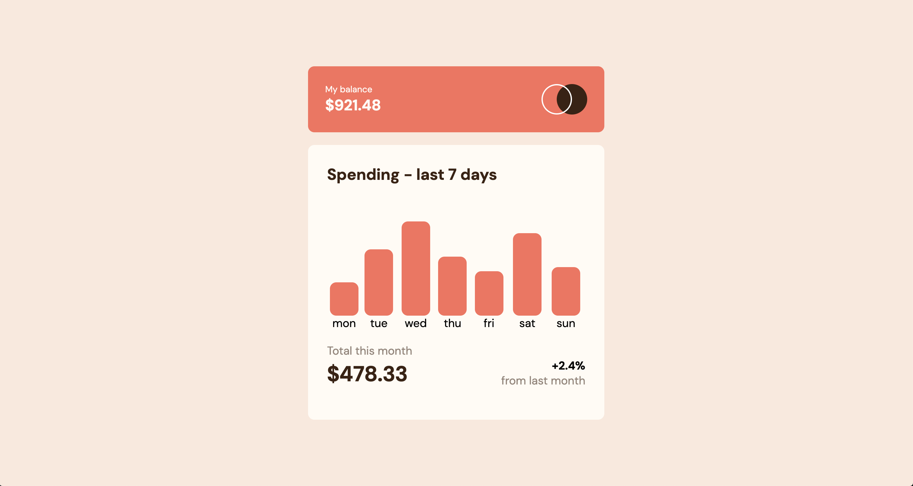

# Frontend Mentor - Expenses chart component solution

This is a solution to the [Expenses chart component challenge on Frontend Mentor](https://www.frontendmentor.io/challenges/expenses-chart-component-e7yJBUdjwt). Frontend Mentor challenges help you improve your coding skills by building realistic projects. 

## Table of contents

- [Overview](#overview)
  - [The challenge](#the-challenge)
  - [Screenshot](#screenshot)
  - [Links](#links)
- [My process](#my-process)
  - [Built with](#built-with)
  - [What I learned](#what-i-learned)
  - [Continued development](#continued-development)
- [Author](#author)

**Note: Delete this note and update the table of contents based on what sections you keep.**

## Overview

### The challenge

Users should be able to:

- View the bar chart and hover over the individual bars to see the correct amounts for each day
- See the current day’s bar highlighted in a different colour to the other bars
- View the optimal layout for the content depending on their device’s screen size
- See hover states for all interactive elements on the page
- **Bonus**: Use the JSON data file provided to dynamically size the bars on the chart

### Screenshot



### Links

- Solution URL: (https://alfiemitchell123.github.io/Expenses-Chart-Component/)

## My process

### Built with

- Semantic HTML5 markup
- CSS custom properties
- Flexbox
- CSS Grid
- Sass
- JavaScript

### What I learned

I learned a lot in this project. One of the main things I took from it, was the ability to extract data from a JSON file and display it accordingly on the page. I used asyncronous functions to process the data and template literals to render it dynamically on the page. This is a powerful feature in JavaScript and I look forward to using it in bigger projects.

To see how you can add code snippets, see below:

```js
const res = await fetch('data.json');
const data = await res.json();

const amount = `<div class="day"><p class="p-amount">${expense.amount}</p></div>`;
document.querySelector('ul').insertAdjacentHTML('beforeend', amount);
```

### Continued development

I would like to use my newfound knowledge of JSON manipulation to create larger, more complex applications. Furthermore, I would like to learn more about HTTP requests to read, write and delete JSON data to create dynamic user experiences.

## Author

- Frontend Mentor - [@yourusername](https://www.frontendmentor.io/profile/alfiemitchell123)